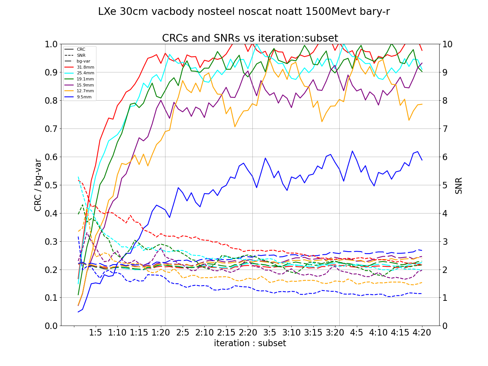
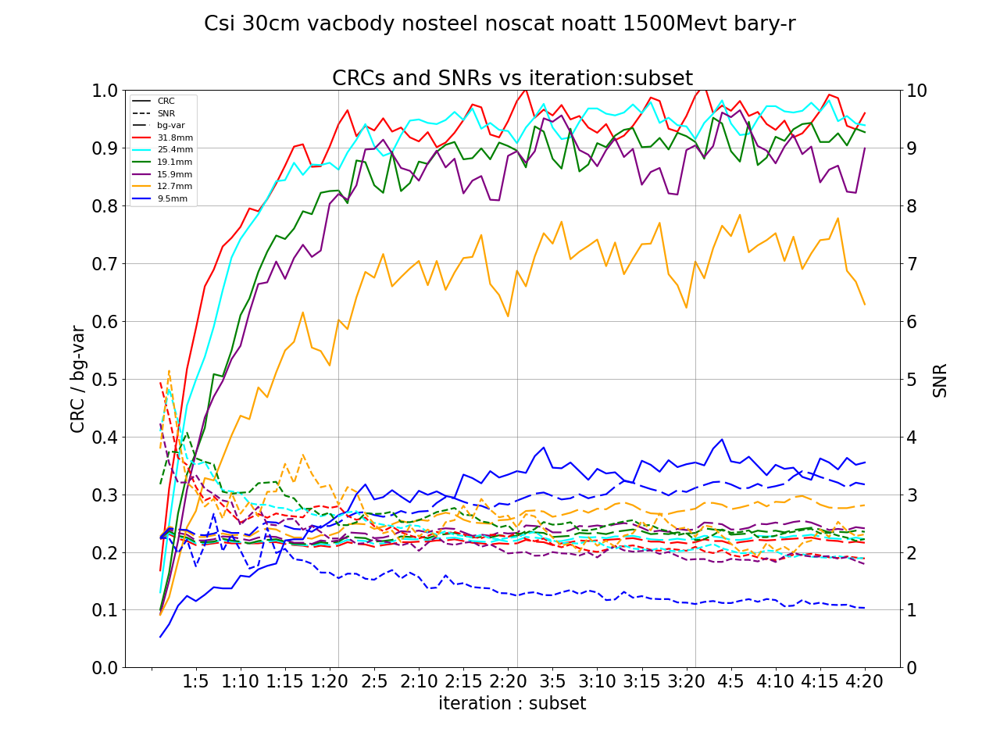
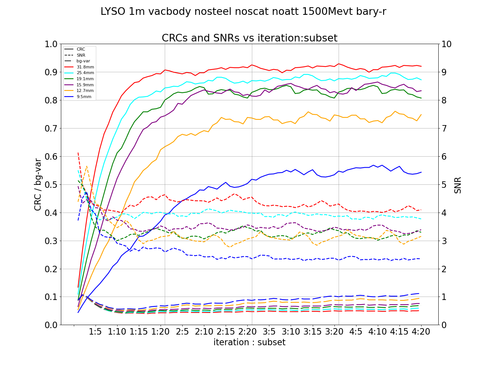
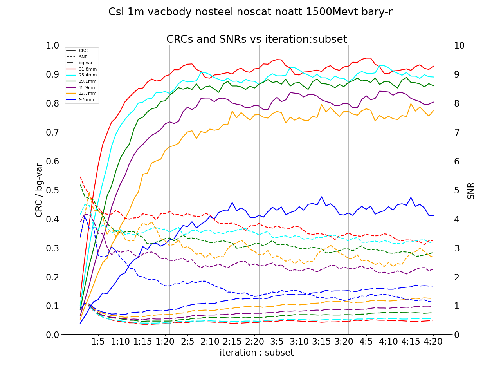
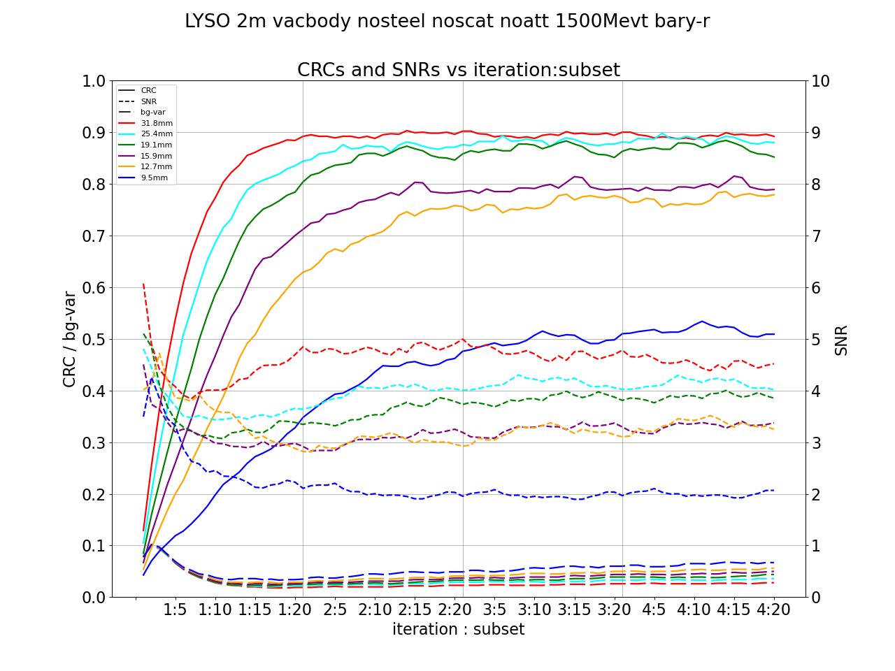
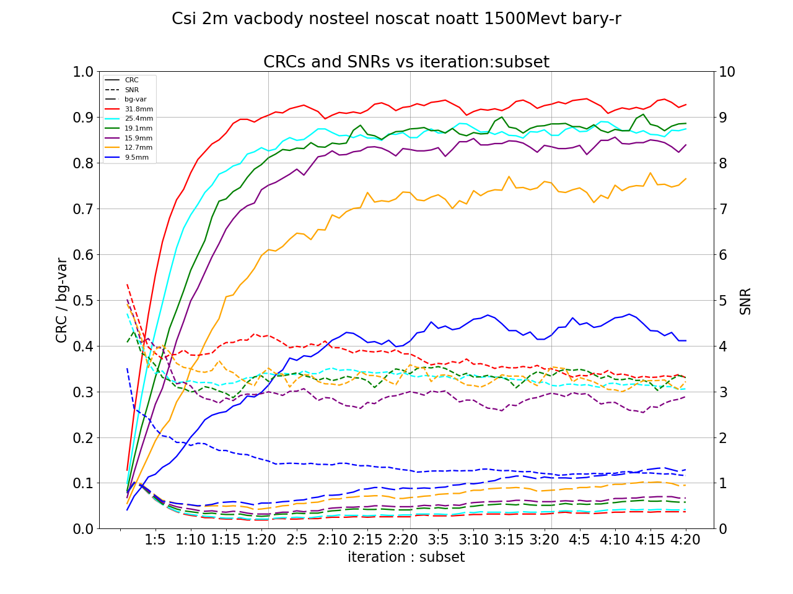

+ 1500 million events
+ Scintillator cell size: 6 mm
+ Voxel size: 3 mm
+ Vacuum phantom
+ No steel
+ Bary-r
+ Attenuation correction: NO
+ Scatter correction: NO

|        | LYSO                                                                                        | LXe                                                                                       | CsI                                                                                       |
|--------|---------------------------------------------------------------------------------------------|-------------------------------------------------------------------------------------------|-------------------------------------------------------------------------------------------|
| 30 cm  |   39 M LORs |  18 M LORs |  16 M LORs |
| 100 cm |  130 M LORs |  59 M LORs |  54 M LORs |
| 200 cm |  178 M LORs |  78 M LORs |  73 M LORs |

